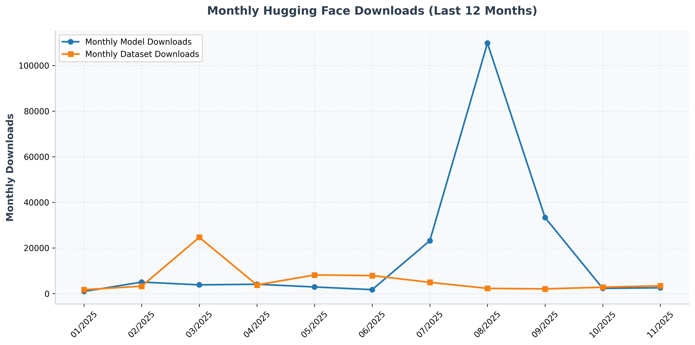

# Hi, I'm Yang Tan 👋

 <!-- 🔄 stars -->
 <!-- 🔄 forks -->
 <!-- 🔄 total_hf_models -->
 <!-- 🔄 total_hf_datasets -->

**AI Research**: Large Language Models, Graph Neural Networks

**Biology Research**: Directed Evolution, Function Prediction, Binder Design

**Email**: <a href="mailto:tanyang.august@gmail.com">tanyang.august@gmail.com</a>

**Website**: https://tyang816.github.io/

**Platform**: https://venusfactory.cn/playground/

## 🎈 Seleted Papers
- **Tan Y**, Liu C, Gao J, et al. [VenusFactory: An Integrated System for Protein Engineering with Data Retrieval and Language Model Fine-Tuning](https://aclanthology.org/2025.acl-demo.23/). *ACL Demo*, 2025.
- **Tan Y**, Wang R, Wu B, et al. [From high-throughput evaluation to wet-lab studies: advancing mutation effect prediction with a retrieval-enhanced model](https://academic.oup.com/bioinformatics/article/41/Supplement_1/i401/8199374). *ISMB/ECCB*, 2025.
- Li S*, **Tan Y***, Ke S, et al. [Immunogenicity Prediction with Dual Attention Enables Vaccine Target Selection](https://openreview.net/forum?id=hWmwL9gizZ). *ICLR*, 2025.
- Li M*, **Tan Y***, Ma X, et al. [ProSST: Protein Language Modeling with Quantized Structure and Disentangled Attention](https://openreview.net/forum?id=4Z7RZixpJQ&referrer=%5Bthe%20profile%20of%20Bozitao%20Zhong%5D(%2Fprofile%3Fid%3D~Bozitao_Zhong1)). *NeurIPS*, 2024.
- **Tan Y**, Zhou B, Zheng L, et al. [Semantical and Topological Protein Encoding Toward Enhanced Bioactivity and Thermostability](https://elifesciences.org/reviewed-preprints/98033). *eLife*, 2024.
- **Tan Y**, Zhang Z, Li M, et al. [MedChatZH: A tuning LLM for traditional Chinese medicine consultations](https://www.sciencedirect.com/science/article/pii/S0010482524003743). *Computers in Biology and Medicine*, 2024.

## 📈 Hugging Face Downloads Over Time

Click to expand

